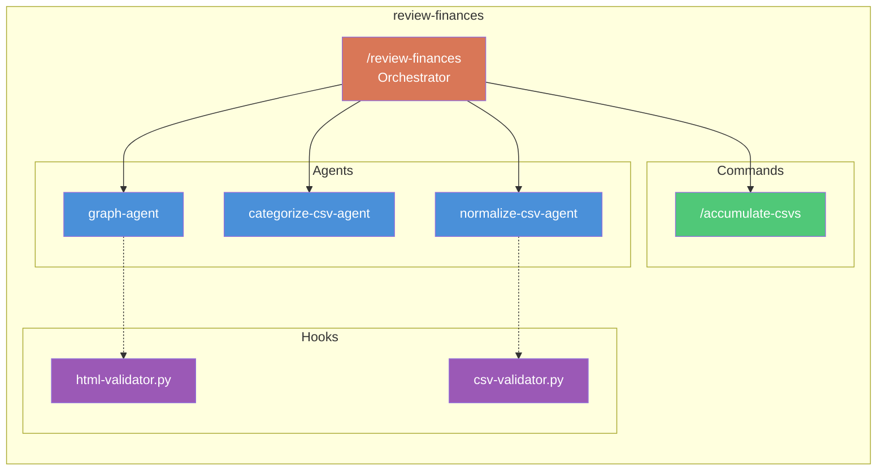

# Link ADW Components

## Purpose

Update Obsidian notes with bidirectional links between workflows (ADWs/Agentic Prompts) and their component agents, commands, and hooks.

## Variables

WORKFLOW_FILE: $ARGUMENTS (path to workflow-analysis.json)
OBSIDIAN_VAULT: CLAUDE.md: OBSIDIAN_VAULT
AI_AGENT_KB: OBSIDIAN_VAULT/AI-Agent-KB

## Instructions

1. Read WORKFLOW_FILE
2. For each identified workflow (ADW or Agentic Prompt):

### Create/Update Workflow Note

For ADWs → `AI_AGENT_KB/01-ADWs/{name}.md`
For Agentic Prompts → `AI_AGENT_KB/10-Agentic-Prompts/{name}.md`

If note doesn't exist:
- Create from `adw-template.md` or `agentic-prompt-template.md`
- Populate with workflow data

If note exists:
- Update the components sections

### Update Component Notes

For each agent in workflow.components.agents:
```
1. Find note at AI_AGENT_KB/02-Agents/{agent-name}.md
2. Add/update "## Part of Workflows" section:
   - [[workflow-name]] (type: agentic-prompt)
3. Save changes
```

Repeat for commands → `08-Commands/`
Repeat for hooks → `09-Hooks/`

### Generate Mermaid Diagrams

For each workflow, generate a mermaid diagram:



### Update Frontmatter Links

In workflow notes, ensure frontmatter has:
```yaml
agents:
  - "[[normalize-csv-agent]]"
  - "[[categorize-csv-agent]]"
commands:
  - "[[accumulate-csvs]]"
hooks:
  - "[[html-validator]]"
```

In component notes, ensure:
```yaml
part_of_workflows:
  - "[[review-finances]]"
```

## Output Format

```json
{
  "workflow_file": "path/to/workflow-analysis.json",
  "link_date": "YYYY-MM-DD",
  "updates": {
    "workflows_created": [
      {"name": "review-finances", "path": "AI_AGENT_KB/10-Agentic-Prompts/review-finances.md"}
    ],
    "workflows_updated": [],
    "components_linked": [
      {"name": "normalize-csv-agent", "linked_to": ["review-finances"]}
    ]
  },
  "summary": {
    "workflows_created": 0,
    "workflows_updated": 0,
    "components_linked": 0,
    "diagrams_generated": 0
  }
}
```

## Report

```
## Component Linking Report

### Workflows Created
| Name | Type | Path |
|------|------|------|
| review-finances | agentic-prompt | AI_AGENT_KB/10-Agentic-Prompts/review-finances.md |

### Components Linked
| Component | Type | Linked To |
|-----------|------|-----------|
| normalize-csv-agent | agent | review-finances |

### Mermaid Diagrams
Generated diagrams for:
- review-finances

### Summary
- Workflows created: {count}
- Workflows updated: {count}
- Components linked: {count}

### Results saved to:
- JSON: TARGET_FOLDER/link-results.json
```


