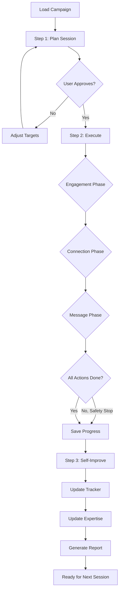

# LinkedIn Expert - Plan Build Improve Workflow

> Complete LinkedIn campaign cycle: **plan → execute → self-improve**. Runs the full outreach pipeline and updates expertise with results.

## Purpose
Execute a complete LinkedIn outreach campaign by chaining three phases:
1. **Plan** (ACT) - Review campaign list, set daily targets, confirm messaging
2. **Build** (ACT) - Execute the campaign via browser automation (engage, connect, message)
3. **Self-Improve** (LEARN) - Update expertise and prospect_master with results

## Usage
```
/experts:linkedin:plan_build_improve [campaign_name_or_request]
```

## Allowed Tools
All tools — this is a full execution workflow.

## Variables
- **USER_PROMPT**: Campaign name or new campaign request
- **PROSPECT_MASTER**: `.claude/context/linkedin/prospect_master.json`

---

## The Campaign Cycle

```
┌─────────────────────────────────────────────────────────┐
│              PLAN → EXECUTE → IMPROVE                    │
├─────────────────────────────────────────────────────────┤
│                                                          │
│  ┌─────────┐     ┌─────────┐     ┌─────────┐           │
│  │  PLAN   │ ──► │ EXECUTE │ ──► │ IMPROVE │           │
│  └─────────┘     └─────────┘     └─────────┘           │
│      │               │               │                   │
│      ▼               ▼               ▼                   │
│  Review list,     Browser agent    Update tracker,      │
│  set targets,     runs outreach    update expertise,    │
│  confirm msgs     with pacing      log learnings        │
│                                                          │
└─────────────────────────────────────────────────────────┘
```

---

## Workflow Steps

### Step 1: Plan Today's Session (2 min)

1. Read `prospect_master.json` to get current campaign state
2. Read the campaign source file for prospect details and messaging
3. Check `activity_log` for what was done yesterday / this week
4. Calculate remaining daily and weekly budget:
   - Connection requests: 20/day, 100/week minus already sent this week
   - Profile views: 50/day minus already viewed today
   - Engagements: 15/day minus already done today
5. Determine today's actions based on campaign execution plan:
   - Which tier are we in? (A first, then B, then C)
   - Which prospects are next in queue? (by status: researched → engaged → connection_sent)
   - What action is next for each? (engage → connect → message)
6. Present the plan to user for approval:

```markdown
## Today's LinkedIn Session Plan

**Campaign**: {name}
**Date**: {today}

### Budget Remaining
| Action | Used Today | Remaining Today | Used This Week | Remaining This Week |
|--------|-----------|-----------------|----------------|---------------------|
| Connections | {n} | {n} | {n} | {n} |
| Profile views | {n} | {n} | {n} | {n} |
| Engagements | {n} | {n} | {n} | {n} |

### Today's Targets
1. {Action} — {Prospect Name} ({Tier}, fit: {score})
2. {Action} — {Prospect Name} ({Tier}, fit: {score})
...

### Messaging Preview
**Connection note for {name}**: "{note}"
**Connection note for {name}**: "{note}"

Approve? (y/n)
```

---

### Step 2: Execute Campaign (30-60 min)

Launch the browser agent to execute today's plan. The agent will:

#### Phase A: Engagement Farming (if prospects need warming)
For each prospect with status "researched" that needs engagement first:
1. Navigate to their profile → Activity tab
2. Like 1-2 recent posts
3. Optionally comment on 1 post (genuine, non-promotional)
4. Update prospect status to "engaged" in tracker
5. Wait 3-5s between actions

#### Phase B: Connection Requests (main action)
For each prospect ready for connection (status "engaged" or "researched" for Tier A):
1. Navigate to their profile
2. Click Connect → Add Note → Fill personalized note → Send
3. Update prospect status to "connection_sent" in tracker
4. Wait 5-10s between requests

#### Phase C: Follow-up Messages (for accepted connections)
For each prospect with status "connected" who hasn't been messaged:
1. Navigate to their profile or messaging
2. Send discovery call pitch message
3. Update prospect status to "message_sent" in tracker
4. Wait 5-10s between messages

#### Blocklist Enforcement
Before EVERY interaction, check: company contains "Accenture Federal" → SKIP

#### Pacing & Safety
- All delays randomized within ranges
- After every 10 actions: 60-second pause
- After every 30 minutes: 5-minute break
- CAPTCHA or "unusual activity" → STOP, save progress, report

---

### Step 3: Self-Improve (5 min)

After execution completes:

1. **Update prospect_master.json**:
   - Update each prospect's status and status_history
   - Append to engagement_log and outreach_log
   - Update campaign metrics (totals)
   - Append to activity_log with today's counts

2. **Analyze results**:
   - How many actions completed vs planned?
   - Any CAPTCHA or throttling issues?
   - Which connection notes were used?
   - Any patterns in what worked/didn't?

3. **Update expertise.md** (if new learnings):
   - New pacing rules discovered
   - Updated CSS selectors for LinkedIn UI changes
   - New messaging patterns that resonated
   - Safety incidents

4. **Generate session report**:

```markdown
## LinkedIn Campaign Session Report — {date}

### Campaign: {name}
### Phase: {Plan/Execute/Improve}

### Actions Completed
| Action | Planned | Completed | Success Rate |
|--------|---------|-----------|-------------|
| Engagements | {n} | {n} | {pct} |
| Connections | {n} | {n} | {pct} |
| Messages | {n} | {n} | {pct} |

### Prospect Updates
| Name | Previous Status | New Status | Action Taken |
|------|----------------|------------|-------------|
| {name} | researched | engaged | Liked 2 posts |

### Pipeline Snapshot
| Status | Count |
|--------|-------|
| Researched | {n} |
| Engaged | {n} |
| Connection sent | {n} |
| Connected | {n} |
| Message sent | {n} |
| Replied | {n} |
| Call booked | {n} |

### Issues
- {any problems encountered}

### Next Session
- {what to do tomorrow based on current state}
```

---

## Flow Control



---

## Examples

### Example 1: First session of new campaign
```
/experts:linkedin:plan_build_improve PSU-EXEC-001
```
Plan: Engage Tier A prospects (5 people, like their posts)
Execute: Browser farms engagement on 5 profiles
Improve: Update statuses to "engaged", log activity

### Example 2: Mid-campaign connection blast
```
/experts:linkedin:plan_build_improve PSU-EXEC-001
```
Plan: Send connections to 15 engaged+researched prospects
Execute: Browser sends 15 personalized connection requests
Improve: Update statuses to "connection_sent", track acceptance over coming days

### Example 3: Follow-up and conversion
```
/experts:linkedin:plan_build_improve PSU-EXEC-001
```
Plan: Message 8 accepted connections with discovery call pitch
Execute: Browser sends 8 personalized messages
Improve: Update statuses to "message_sent", track reply rate
