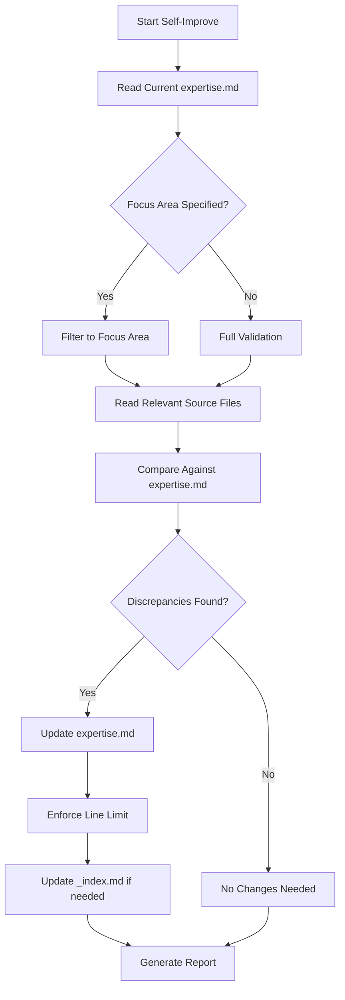

# Overstory Expert - Self-Improve Mode

> Maintain Overstory expertise accuracy by validating against the source repository.

## Purpose
Synchronize the Overstory expertise file against the authoritative source at `C:/Users/gblac/OneDrive/Desktop/overstory`.

## Usage
```
/experts:overstory:self-improve [focus_area]
```

## Allowed Tools
`Read`, `Grep`, `Glob`, `Bash`, `Edit`, `Write`

## Variables
- **FOCUS_AREA**: Optional area to prioritize (e.g., "commands", "runtimes", "agents", "config")
- **MAX_LINES**: 1500 (enforced limit for expertise.md)

---

## Source Validation Checklist

### Core Documentation
| File | Last Validated | Status |
|------|---------------|--------|
| `README.md` | 2026-03-12 | |
| `CLAUDE.md` | 2026-03-12 | |
| `STEELMAN.md` | 2026-03-12 | |
| `CHANGELOG.md` | 2026-03-12 | |
| `CONTRIBUTING.md` | 2026-03-12 | |
| `package.json` | 2026-03-12 | |

### Agent Definitions (9 files)
| File | Last Validated | Status |
|------|---------------|--------|
| `agents/coordinator.md` | 2026-03-12 | |
| `agents/orchestrator.md` | 2026-03-12 | |
| `agents/lead.md` | 2026-03-12 | |
| `agents/scout.md` | 2026-03-12 | |
| `agents/builder.md` | 2026-03-12 | |
| `agents/reviewer.md` | 2026-03-12 | |
| `agents/merger.md` | 2026-03-12 | |
| `agents/monitor.md` | 2026-03-12 | |
| `agents/supervisor.md` | 2026-03-12 | |

### Runtime Adapters (7 files)
| File | Last Validated | Status |
|------|---------------|--------|
| `src/runtimes/claude.ts` | 2026-03-12 | |
| `src/runtimes/pi.ts` | 2026-03-12 | |
| `src/runtimes/copilot.ts` | 2026-03-12 | |
| `src/runtimes/codex.ts` | 2026-03-12 | |
| `src/runtimes/gemini.ts` | 2026-03-12 | |
| `src/runtimes/sapling.ts` | 2026-03-12 | |
| `src/runtimes/opencode.ts` | 2026-03-12 | |

### Key Source Files
| File | Last Validated | Status |
|------|---------------|--------|
| `src/types.ts` | 2026-03-12 | |
| `src/config.ts` | 2026-03-12 | |
| `src/commands/sling.ts` | 2026-03-12 | |
| `src/merge/resolver.ts` | 2026-03-12 | |
| `src/watchdog/daemon.ts` | 2026-03-12 | |
| `src/mail/store.ts` | 2026-03-12 | |

---

## Workflow



---

## Validation Steps

### Step 1: Read Current Expertise
Read `expertise.md` and parse current mental model.

### Step 2: Check Version
```bash
# Compare package.json version against expertise.md header
Read C:/Users/gblac/OneDrive/Desktop/overstory/package.json
```

### Step 3: Validate Against Source
For each focus area:
1. Read the source file(s)
2. Extract key concepts, types, patterns
3. Compare against expertise.md section
4. Note discrepancies

### Step 4: Check for New Files
```bash
# Look for new commands, runtimes, agent definitions
Glob pattern="src/commands/*.ts" path="C:/Users/gblac/OneDrive/Desktop/overstory"
Glob pattern="src/runtimes/*.ts" path="C:/Users/gblac/OneDrive/Desktop/overstory"
Glob pattern="agents/*.md" path="C:/Users/gblac/OneDrive/Desktop/overstory"
```

### Step 5: Update Expertise
Apply discovered updates. Enforce 1500 line limit.

### Step 6: Update Index
If new capabilities or major changes found, update `_index.md`.

---

## Focus Areas

| Focus | Files to Validate |
|-------|-------------------|
| `commands` | `src/commands/*.ts`, `README.md` CLI reference |
| `runtimes` | `src/runtimes/*.ts`, `docs/runtime-*.md` |
| `agents` | `agents/*.md`, `src/agents/*.ts` |
| `config` | `src/config.ts`, `.overstory/config.yaml` |
| `merge` | `src/merge/*.ts` |
| `mail` | `src/mail/*.ts` |
| `watchdog` | `src/watchdog/*.ts` |
| `metrics` | `src/metrics/*.ts` |
| `doctor` | `src/doctor/*.ts` |
| `all` | Everything above |

---

## Report Format

```markdown
## Self-Improvement Report

### Summary
- **Version**: {current version}
- **Discrepancies Found**: X
- **Updates Applied**: Y
- **Final Line Count**: Z/1500 lines

### Source Validation
| Area | Status | Changes |
|------|--------|---------|
| Commands | ... | ... |
| Runtimes | ... | ... |
| Agents | ... | ... |

### Changes Applied
1. {Change 1}
2. {Change 2}

### Recommendations
- {Recommendation 1}
```
