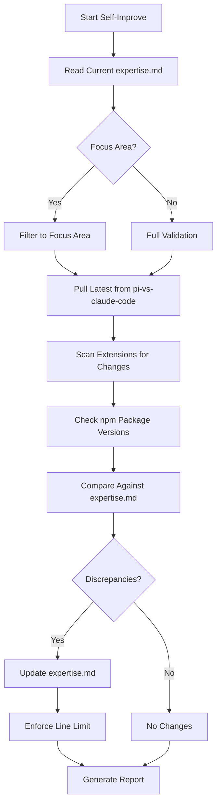

# Pi Agent Expert - Self-Improve Mode

> Maintain Pi expertise accuracy by validating against source code and documentation.

## Purpose
Synchronize the Pi expertise file against the authoritative sources:
1. **pi-vs-claude-code repo** — Extensions, agents, comparison docs
2. **npm packages** — API surface, types, version changes
3. **Official docs** — https://docs.openclaw.ai

## Usage
```
/experts:pi:self-improve [focus_area]
```

## Allowed Tools
`Read`, `Grep`, `Glob`, `Bash`, `Edit`, `Write`

## Variables
- **FOCUS_AREA**: Optional area to prioritize (e.g., "extensions", "events", "tui", "agents", "comparison")
- **MAX_LINES**: 500 (enforced limit for expertise.md)

---

## Source Validation Checklist

### SOURCE 1: pi-vs-claude-code (Extensions Playground)

**Path**: `C:\Users\gblac\OneDrive\Desktop\tac\pi-vs-claude-code`

| File/Dir | What to Check | Status |
|----------|---------------|--------|
| `extensions/*.ts` (16 files) | New extensions added? Existing ones changed? | |
| `.pi/agents/*.md` | New agent definitions? | |
| `.pi/agents/teams.yaml` | New teams? | |
| `.pi/agents/agent-chain.yaml` | New chains? | |
| `COMPARISON.md` | Updated comparisons? | |
| `PI_VS_OPEN_CODE.md` | Updated comparisons? | |
| `TOOLS.md` | Tool signatures changed? | |
| `THEME.md` | New color tokens? | |
| `RESERVED_KEYS.md` | Keybinding changes? | |
| `CLAUDE.md` | Convention changes? | |
| `justfile` | New recipes? | |
| `package.json` | Version bump? New dependencies? | |

### SOURCE 2: npm packages

| Package | Check Command | Status |
|---------|---------------|--------|
| `@mariozechner/pi-coding-agent` | `npm view @mariozechner/pi-coding-agent version` | |
| `@mariozechner/pi-ai` | `npm view @mariozechner/pi-ai version` | |
| `@mariozechner/pi-agent-core` | `npm view @mariozechner/pi-agent-core version` | |
| `@mariozechner/pi-tui` | `npm view @mariozechner/pi-tui version` | |

---

## Workflow



---

## Validation Steps

### Step 1: Pull Latest Source
```bash
cd C:/Users/gblac/OneDrive/Desktop/tac/pi-vs-claude-code && git pull
```

### Step 2: Scan Extensions
```bash
ls extensions/*.ts | wc -l  # Compare count against expertise.md claim of 16
```
For each extension:
1. Read the file
2. Extract event handlers, tools registered, UI APIs used
3. Compare against Part 5 of expertise.md
4. Note new or removed extensions

### Step 3: Check Agent Definitions
```bash
ls .pi/agents/*.md  # Any new agents?
cat .pi/agents/teams.yaml  # Teams changed?
cat .pi/agents/agent-chain.yaml  # Chains changed?
```

### Step 4: Check Package Versions
```bash
npm view @mariozechner/pi-coding-agent version
# Compare against expertise.md header claim
```

### Step 5: Scan for New Events
```bash
grep -r "pi\.on\(" extensions/ | sort -u
# Extract unique event names, compare against Part 2 events table
```

### Step 6: Check Comparison Docs
Read `COMPARISON.md` and `PI_VS_OPEN_CODE.md` for any updated rows or new sections.

### Step 7: Update Expertise File
Apply all discovered updates to `expertise.md`:
- Add new extensions to Part 5
- Update event tables in Part 2
- Correct version numbers
- Update comparison tables in Part 6
- Add new agent definitions to Part 4

### Step 8: Enforce Line Limit
If expertise.md exceeds 500 lines, condense verbose sections.

---

## Report Format

```markdown
## Pi Self-Improvement Report

### Summary
- **Discrepancies Found**: X
- **Updates Applied**: Y
- **Package Version**: {current}
- **Extension Count**: {current}
- **Final Line Count**: Z/500 lines

### Source Validation

#### Extensions (pi-vs-claude-code)
| Extension | Status | Changes |
|-----------|--------|---------|
| minimal.ts | Validated | None |
| agent-team.ts | Updated | New dispatcher mode |
| ... | | |

#### Agent Definitions
| File | Status | Changes |
|------|--------|---------|
| scout.md | Validated | None |
| ... | | |

#### Comparison Docs
| Doc | Status | Changes |
|-----|--------|---------|
| COMPARISON.md | Updated | New MCP row |
| ... | | |

### Changes Applied
1. {Change 1}
2. {Change 2}

### Recommendations
- {Recommendation 1}
```

---

## Focus Areas

| Focus | What to Validate |
|-------|-----------------|
| `extensions` | All 16 extension files, new extensions |
| `events` | Event names, blocking capability, handler signatures |
| `tui` | UI APIs, theme tokens, keybindings |
| `agents` | Agent .md files, teams.yaml, agent-chain.yaml |
| `comparison` | COMPARISON.md, PI_VS_OPEN_CODE.md tables |
| `sdk` | npm versions, CLI flags, SDK API surface |
| `all` | Full validation (default) |
