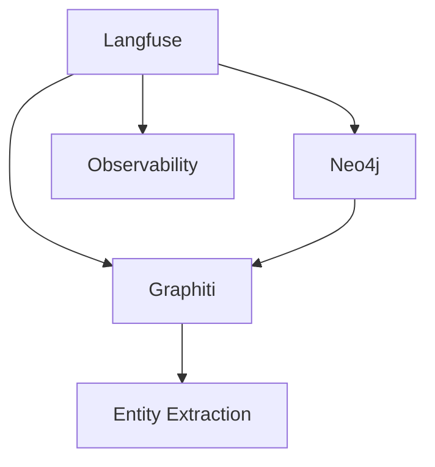

Create a visual representation of connections for a concept in the Neo4j knowledge graph.

If no concept is provided, ask: "Which concept would you like to visualize?"

Once you have the concept:

1. Query Neo4j to find the entity
2. Get all direct connections (relationships)
3. Get connections of connections (2 degrees)
4. Calculate connection strength (number of shared relationships)

Display as:

1. **Mermaid Diagram**: A graph visualization showing the concept and its connections
2. **Connection List**: All connected concepts with relationship types
3. **Connection Strength**: Ranked by number of connections
4. **Suggested Explorations**: Interesting patterns or clusters noticed

Example output:

Include:
- Direct connections (1 degree)
- Important indirect connections (2 degrees)
- Relationship types when available
- Suggestion for deeper exploration

Example: `/obsidian-graph langfuse` or `/obsidian-graph authentication`
