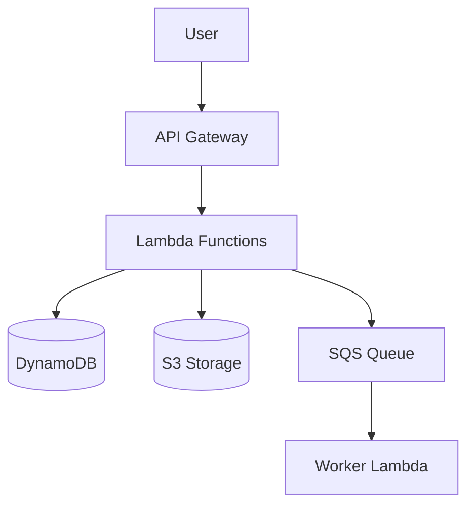

Generate a comprehensive Architecture Decision Record documenting key decisions from an architecture discussion.

## Instructions

If the user didn't provide a file path or notes, ask:
"Please provide either:
1. Path to meeting notes/transcript file
2. Paste the meeting notes directly
3. Summarize the key decisions made"

Once you have the input:

### Step 1: Extract Decision Context

Identify from the notes:

1. **Decisions Made** - What was decided
2. **Options Considered** - Alternatives discussed
3. **Decision Rationale** - Why this option was chosen
4. **Consequences** - Trade-offs and implications
5. **Decision Makers** - Who was involved
6. **Open Questions** - What's still unresolved

### Step 2: Categorize Decisions

Group decisions by type:
- **Architecture Patterns** - System design, microservices, serverless, etc.
- **Technology Choices** - Languages, frameworks, AWS services
- **Data Architecture** - Storage, databases, caching, data flow
- **Security & Compliance** - Authentication, encryption, compliance approach
- **Integration Strategy** - How systems connect, APIs, events
- **Operational Decisions** - Monitoring, logging, deployment, CI/CD
- **Constraints Accepted** - Timeline, budget, technical limitations

### Step 3: Generate ADR Document

Create a comprehensive Architecture Decision Record:

```markdown
# Architecture Decision Record: [Project Name]

**Date:** [Meeting date]
**Status:** Proposed | Accepted | Superseded
**Participants:** [Names and roles]
**Context:** Architecture discussion for [project goal]

---

## Executive Summary

[2-3 sentence summary of the architecture and key decisions]

---

## Problem Statement

### Business Goal
[What business problem is being solved]

### Technical Challenge
[What technical challenges must the architecture address]

### Key Requirements
- [Requirement 1]
- [Requirement 2]
- [Requirement 3]

---

## Architecture Decisions

### Decision 1: [e.g., "Serverless vs. Container-based Architecture"]

**Decision:** [What was decided]

**Options Considered:**
1. **Option A:** [Description]
   - Pros: [Benefits]
   - Cons: [Drawbacks]
2. **Option B:** [Description]
   - Pros: [Benefits]
   - Cons: [Drawbacks]
3. **Option C (Selected):** [Description]
   - Pros: [Benefits]
   - Cons: [Drawbacks]

**Rationale:** [Why this option was chosen]

**Consequences:**
- ✅ **Positive:** [Benefits realized]
- ⚠️ **Trade-offs:** [What we give up]
- 🔧 **Mitigations:** [How we address the trade-offs]

**Implementation Impact:**
- Development effort: [Estimate]
- Timeline impact: [Impact]
- Cost impact: [Impact]

---

### Decision 2: [e.g., "Data Storage Strategy"]

[Same structure as Decision 1]

---

[Repeat for all major decisions]

---

## Technology Stack

### Infrastructure
- **Compute:** [e.g., AWS Lambda, ECS Fargate]
- **Storage:** [e.g., S3, DynamoDB, RDS]
- **Networking:** [e.g., API Gateway, VPC, CloudFront]
- **IaC:** [e.g., AWS CDK, Terraform]

### Application
- **Backend:** [Languages, frameworks]
- **Frontend:** [Languages, frameworks]
- **APIs:** [REST, GraphQL, gRPC]

### Data
- **Primary Database:** [Choice and why]
- **Caching:** [Strategy]
- **Data Processing:** [Batch, streaming, real-time]

### Security
- **Authentication:** [Strategy]
- **Authorization:** [Strategy]
- **Encryption:** [At rest, in transit]
- **Compliance:** [Requirements addressed]

### Operations
- **Monitoring:** [Tools and approach]
- **Logging:** [Strategy]
- **CI/CD:** [Pipeline approach]
- **Deployment:** [Strategy]

---

## Architecture Diagram

[Generate Mermaid diagram based on decisions]



---

## Data Flow

### Primary User Flow
1. [Step 1]
2. [Step 2]
3. [Step 3]

### Integration Flows
- **[System A]** → [Data flow description]
- **[System B]** → [Data flow description]

---

## Security Architecture

### Authentication Flow
[Describe how users authenticate]

### Data Protection
- **PII Handling:** [Strategy]
- **Encryption:** [Approach]
- **Access Control:** [Strategy]

### Compliance
- **[Regulation]:** [How addressed]

---

## Operational Considerations

### Scaling Strategy
- **Horizontal Scaling:** [Approach]
- **Vertical Scaling:** [Approach]
- **Auto-scaling Triggers:** [What triggers scale events]

### Disaster Recovery
- **RTO:** [Recovery Time Objective]
- **RPO:** [Recovery Point Objective]
- **Backup Strategy:** [Approach]

### Monitoring & Alerting
- **Key Metrics:** [What to monitor]
- **Alert Thresholds:** [When to alert]
- **On-Call:** [Who responds]

---

## Constraints & Assumptions

### Accepted Constraints
- [Constraint 1 and why it's acceptable]
- [Constraint 2 and why it's acceptable]

### Key Assumptions
- [Assumption 1 and what happens if it's wrong]
- [Assumption 2 and what happens if it's wrong]

### Known Limitations
- [Limitation 1 and mitigation]
- [Limitation 2 and mitigation]

---

## Risks & Mitigations

| Risk | Likelihood | Impact | Mitigation |
|------|------------|--------|------------|
| [Risk 1] | High/Med/Low | High/Med/Low | [How we'll address it] |
| [Risk 2] | High/Med/Low | High/Med/Low | [How we'll address it] |

---

## Open Questions & Follow-ups

### Unresolved Questions
1. **[Question 1]**
   - Owner: [Who will answer]
   - Deadline: [When needed]
   - Blocker: [Does it block progress?]

2. **[Question 2]**
   - Owner: [Who will answer]
   - Deadline: [When needed]
   - Blocker: [Does it block progress?]

### Deferred Decisions
- **[Decision topic]** - Will be decided in [Phase 2 / when we have more info]

---

## Next Steps

### Immediate (This Week)
- [ ] [Action item 1]
- [ ] [Action item 2]

### Short-term (Next 2 Weeks)
- [ ] [Action item 3]
- [ ] [Action item 4]

### Before Development Starts
- [ ] [Action item 5]
- [ ] [Action item 6]

---

## Approval

**Recommended By:** [Architect name]
**Approved By:** [Decision maker name]
**Date:** [Approval date]

**Sign-off:**
- [ ] Technical Lead
- [ ] Security Team
- [ ] Operations Team
- [ ] Product Owner

---

## References

- Meeting transcript: [Link or path]
- Related ADRs: [Links]
- Reference architecture: [Links]
- Documentation: [Links]

---

## Appendix: Detailed Technical Specifications

[Any additional technical details, API specs, data schemas, etc.]

---

**Document Version:** 1.0
**Last Updated:** [Date]
**Next Review:** [Date]
```

---

## Output Options

After generating the ADR, offer to:

1. **Save to file** (suggest: `specs/architecture/ADR-[date]-[project-name].md`)
2. **Generate Mermaid diagrams** for specific components
3. **Create follow-up action items** as GitHub issues or project tasks
4. **Generate email summary** for stakeholders who weren't in the meeting
5. **Create presentation slides** from the ADR for broader team sharing

---

## Example Usage

```
/generate-adr path/to/meeting-notes.md
/generate-adr path/to/meeting-transcript.txt
/generate-adr [paste notes here]
```

---

## Tips for Best Results

### Before Generation
- Ensure meeting notes capture decisions, not just discussion
- Note who made each decision
- Record alternatives that were considered

### During Generation
- Review the generated ADR for accuracy
- Add context that wasn't in the notes
- Clarify any ambiguous decisions

### After Generation
- Share with all meeting participants for review
- Get sign-off from decision makers
- Link from project README
- Update as architecture evolves

---

## Integration with Other Commands

**Pre-meeting:**
```
/analyze-transcripts [folder] → /generate-adr [meeting-notes]
```

**Post-meeting:**
```
/generate-adr [notes] → /consulting-questions [to verify nothing missed]
```

**Complete workflow:**
```
1. /analyze-transcripts → Prep questions
2. [Hold architecture meeting]
3. /generate-adr → Document decisions
4. /consulting-questions → Verify coverage
```
