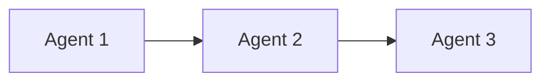

# Obsidian AI Agent Knowledge Base - Implementation Plan

> **Handoff Document for Implementation Agent**
> Created: 2026-01-14
> Target Obsidian Vault: `C:\Users\gblac\OneDrive\Desktop\obsidian\Gbautomation`

---

## 🎯 Objective

Create a comprehensive Obsidian knowledge base to monitor and manage AI agent workflows with a visual hierarchy using color-coded note types.

---

## 📊 Hierarchy Structure

```
ADWs (AI Developer Workflows)        🟣 Purple
├── Agents                           🔵 Blue
│   ├── Skills                       🟢 Green
│   │   ├── Prompts                  🟡 Yellow
│   │   └── Scripts/Code             🟠 Orange
│   └── MCP Servers                  🔴 Red
```

---

## 🔬 Research Summary: Official Anthropic Documentation

### 1. Skills (Official Claude Code Skills)

**Source**: [code.claude.com/docs/en/skills](https://code.claude.com/docs/en/skills), [support.claude.com](https://support.claude.com/en/articles/12512198-how-to-create-custom-skills)

**Definition**: Skills are modular, reusable capabilities that Claude can automatically discover and invoke when a request matches the Skill's description. They package expertise, workflows, and domain knowledge into self-contained units.

#### Skill Components (Official Structure):

```
skill-name/
├── SKILL.md              # Core file with frontmatter + instructions
├── scripts/              # Executable code (Python, Shell, etc.)
│   └── main.py
├── templates/            # Output templates
│   └── report.md
└── resources/            # Reference files, data
    └── examples.json
```

#### SKILL.md Required Metadata (YAML Frontmatter):

| Field | Description | Limit |
|-------|-------------|-------|
| `name` | Human-friendly name | 64 chars |
| `description` | What it does & when to use it | 200 chars |
| `dependencies` | Required packages (optional) | - |

#### Example SKILL.md:

```yaml
---
name: API Documentation Generator
description: Generate comprehensive API documentation from code comments and OpenAPI specs. Use when documenting REST endpoints.
dependencies: python>=3.8, jinja2>=3.0
---

## Instructions

1. Scan the target directory for endpoint definitions
2. Extract docstrings and type hints
3. Generate markdown documentation using the provided template

## Reference Files
- `templates/api-doc.md` - Output template
- `scripts/extract_endpoints.py` - Extraction logic
```

#### Advanced Skill Features:

- **Progressive Disclosure**: Metadata loads first; full content only when needed
- **allowed-tools**: Restrict which tools a Skill can access
- **Forked Context**: Run Skills in isolated context
- **Hooks**: Define pre/post execution actions
- **Visibility Control**: `model-only`, `user-only`, or `both`
- **Subagent Integration**: Skills can spawn or delegate to subagents

---

### 2. CLAUDE.md (Project Configuration)

**Source**: [humanlayer.dev](https://www.humanlayer.dev/blog/writing-a-good-claude-md), [gend.co](https://www.gend.co/blog/claude-skills-claude-md-guide)

**Purpose**: Onboard Claude to your codebase at the start of every session. Auto-loaded by Claude Code.

#### CLAUDE.md Structure:

```markdown
## WHAT - Tech Stack & Project Structure
- Framework: Next.js 14
- Database: PostgreSQL + Prisma
- Key directories: /src, /lib, /components

## WHY - Project Purpose
- Main goal: Customer support automation
- Key features: Ticket routing, knowledge base search

## HOW - Development Workflow
- Run tests: `npm test`
- Start dev: `npm run dev`
- Lint: `npm run lint`
- Build: `npm run build`
```

#### Key Principles:
- LLMs are stateless - CLAUDE.md provides persistent context
- Don't overload with every possible command
- Focus on WHAT, WHY, and HOW
- Can have nested CLAUDE.md files in subdirectories

---

### 3. MCP Servers (Model Context Protocol)

**Source**: [modelcontextprotocol.io](https://modelcontextprotocol.io/specification/2025-11-25), [anthropic.com/news/model-context-protocol](https://www.anthropic.com/news/model-context-protocol)

**Definition**: MCP is an open protocol for connecting AI systems with external data sources and tools. Think of it as "USB-C for AI" - a universal adapter.

#### MCP Server Components:

| Component | Description |
|-----------|-------------|
| **Prompts** | Pre-defined prompt templates the server exposes |
| **Resources** | Data sources the server can access (files, DBs, APIs) |
| **Tools** | Functions the AI can call (read, write, execute) |

#### MCP Architecture:

```
┌─────────────────┐         ┌─────────────────┐
│   MCP Client    │◄───────►│   MCP Server    │
│ (Claude Code,   │  JSON   │ (Your service)  │
│  Claude Desktop)│  RPC    │                 │
└─────────────────┘         └─────────────────┘
                                    │
                            ┌───────┴───────┐
                            ▼               ▼
                      [External APIs]  [Databases]
```

#### MCP Server Features:

- **Tools**: Functions Claude can invoke (e.g., `search_database`, `send_email`)
- **Resources**: Readable data (e.g., `file://`, `postgres://`)
- **Prompts**: Templated prompts for common tasks
- **Authorization**: OAuth 2.1 support
- **Transports**: stdio, HTTP/SSE

---

### 4. Agents & Subagents (Claude Agent SDK)

**Source**: [anthropic.com/engineering/effective-harnesses-for-long-running-agents](https://www.anthropic.com/engineering/effective-harnesses-for-long-running-agents)

#### Agent Components:

| Component | Description |
|-----------|-------------|
| **System Prompt** | Core instructions and personality |
| **Tools** | Available functions/capabilities |
| **Skills** | Reusable capability packages |
| **MCP Connections** | External service integrations |
| **Hooks** | Event-driven automation (pre/post actions) |
| **Memory** | Persistent context (CLAUDE.md, checkpoints) |

#### Agent Patterns (from Anthropic):

1. **Initializer Agent**: Sets up environment on first run
2. **Coding Agent**: Makes incremental progress, leaves artifacts
3. **Orchestrator-Worker**: Delegates subtasks to specialized agents
4. **Evaluator-Optimizer**: Reviews and improves outputs

---

### 5. ADWs (AI Developer Workflows) - Custom Concept

> **Note**: ADW is not an official Anthropic term. It's the user's concept for organizing multiple agents into workflows.

#### Proposed ADW Structure:

```yaml
ADW:
  name: "Customer Onboarding Pipeline"
  description: "End-to-end customer onboarding automation"
  pattern: "orchestrator-worker"
  
  agents:
    - name: "Data Collector"
      role: "Gather customer information"
      triggers: ["new_signup"]
      
    - name: "Profile Builder"
      role: "Create customer profile"
      triggers: ["data_collected"]
      
    - name: "Welcome Messenger"
      role: "Send onboarding communications"
      triggers: ["profile_complete"]
  
  connections:
    - from: "Data Collector"
      to: "Profile Builder"
      data: "customer_data"
```

---

## 🎨 Obsidian Implementation Plan

### Folder Structure

```
Gbautomation/
├── 📁 AI-Agent-KB/
│   ├── 📁 ADWs/                    # AI Developer Workflows
│   │   ├── _ADW-Template.md
│   │   └── [workflow-name].md
│   │
│   ├── 📁 Agents/                  # Individual Agents
│   │   ├── _Agent-Template.md
│   │   └── [agent-name].md
│   │
│   ├── 📁 Skills/                  # Reusable Skills
│   │   ├── _Skill-Template.md
│   │   └── [skill-name].md
│   │
│   ├── 📁 Prompts/                 # Prompt Library
│   │   ├── _Prompt-Template.md
│   │   └── [prompt-name].md
│   │
│   ├── 📁 Scripts/                 # Code/Scripts
│   │   ├── _Script-Template.md
│   │   └── [script-name].md
│   │
│   ├── 📁 MCP-Servers/             # MCP Server Configs
│   │   ├── _MCP-Server-Template.md
│   │   └── [server-name].md
│   │
│   ├── 📁 MOCs/                    # Maps of Content
│   │   ├── ADW-Index.md
│   │   ├── Agent-Index.md
│   │   ├── Skill-Index.md
│   │   └── MCP-Index.md
│   │
│   └── 📄 AI-Agent-KB-Dashboard.md  # Main Dashboard
```

### Color Coding (CSS Snippet)

Create `AI-Agent-KB-colors.css` in `.obsidian/snippets/`:

```css
/* ADWs - Purple */
.tag-adw, 
a.tag[href="#adw"],
.cm-tag-adw { 
  background-color: #9B59B6 !important; 
  color: white !important;
  padding: 2px 6px;
  border-radius: 4px;
}

/* Agents - Blue */
.tag-agent,
a.tag[href="#agent"],
.cm-tag-agent { 
  background-color: #3498DB !important;
  color: white !important;
  padding: 2px 6px;
  border-radius: 4px;
}

/* Skills - Green */
.tag-skill,
a.tag[href="#skill"],
.cm-tag-skill { 
  background-color: #27AE60 !important;
  color: white !important;
  padding: 2px 6px;
  border-radius: 4px;
}

/* Prompts - Yellow */
.tag-prompt,
a.tag[href="#prompt"],
.cm-tag-prompt { 
  background-color: #F1C40F !important;
  color: #333 !important;
  padding: 2px 6px;
  border-radius: 4px;
}

/* Scripts - Orange */
.tag-script,
a.tag[href="#script"],
.cm-tag-script { 
  background-color: #E67E22 !important;
  color: white !important;
  padding: 2px 6px;
  border-radius: 4px;
}

/* MCP Servers - Red */
.tag-mcp,
a.tag[href="#mcp"],
.cm-tag-mcp { 
  background-color: #E74C3C !important;
  color: white !important;
  padding: 2px 6px;
  border-radius: 4px;
}

/* Status Tags */
.tag-active { background-color: #2ECC71 !important; }
.tag-development { background-color: #F39C12 !important; }
.tag-deprecated { background-color: #95A5A6 !important; }
```

---

## 📝 Templates

### 1. ADW Template (`_ADW-Template.md`)

```markdown
---
type: adw
name: "{{title}}"
status: development
created: {{date}}
tags: [adw, workflow]
cssclass: adw-note
---

# {{title}}

## Overview
Brief description of the workflow purpose and goals.

## Pattern
- [ ] Prompt Chaining
- [ ] Routing
- [ ] Parallelization
- [ ] Orchestrator-Worker
- [ ] Evaluator-Optimizer
- [ ] Custom

## Agents in Workflow
| Agent | Role | Order | Status |
|-------|------|-------|--------|
| [[Agent-Name]] | Description | 1 | 🟢 Active |

## Workflow Diagram


## Triggers
- What initiates this workflow?

## Data Flow
- What data passes between agents?

## Related
- MCP Servers: [[MCP-Name]]
- Documentation: 

## Changelog
- {{date}}: Created
```

### 2. Agent Template (`_Agent-Template.md`)

```markdown
---
type: agent
name: "{{title}}"
status: active
version: 1.0.0
created: {{date}}
tags: [agent]
cssclass: agent-note
---

# {{title}}

## Purpose
One-line description of what this agent does.

## System Prompt
```
You are a [role] agent responsible for [task].
```

## Skills
| Skill | Purpose | Status |
|-------|---------|--------|
| [[Skill-Name]] | Description | 🟢 Active |

## MCP Servers
| Server | Purpose |
|--------|---------|
| [[MCP-Name]] | Description |

## Tools Available
- `tool_name`: Description

## Configuration
```yaml
model: claude-sonnet-4
max_tokens: 4096
temperature: 0.7
```

## Part of ADWs
- [[ADW-Name]]

## Changelog
- {{date}}: Created
```

### 3. Skill Template (`_Skill-Template.md`)

```markdown
---
type: skill
name: "{{title}}"
version: 1.0.0
status: active
created: {{date}}
tags: [skill]
cssclass: skill-note
dependencies: []
---

# {{title}}

## Description
What this skill does and when Claude should use it (max 200 chars for Anthropic spec).

## SKILL.md Content
```yaml
---
name: {{title}}
description: Brief description for Claude to determine when to use
dependencies: python>=3.8
---
```

## Instructions
Step-by-step instructions for Claude to follow.

## Prompts
| Prompt | Purpose |
|--------|---------|
| [[Prompt-Name]] | Description |

## Scripts
| Script | Language | Purpose |
|--------|----------|---------|
| [[Script-Name]] | Python | Description |

## Usage Examples
```
Example input → Expected output
```

## Used By Agents
- [[Agent-Name]]

## Changelog
- {{date}}: Created
```

### 4. Prompt Template (`_Prompt-Template.md`)

```markdown
---
type: prompt
name: "{{title}}"
version: 1.0.0
created: {{date}}
tags: [prompt]
cssclass: prompt-note
---

# {{title}}

## Purpose
What task does this prompt accomplish?

## Variables
| Variable | Type | Description |
|----------|------|-------------|
| `{{var}}` | string | Description |

## Prompt Content
```
Your prompt template here with {{variables}}
```

## Example Usage
**Input:**
```
Example input values
```

**Output:**
```
Expected output
```

## Part of Skills
- [[Skill-Name]]

## Changelog
- {{date}}: Created
```

### 5. Script Template (`_Script-Template.md`)

```markdown
---
type: script
name: "{{title}}"
language: python
version: 1.0.0
created: {{date}}
tags: [script]
cssclass: script-note
---

# {{title}}

## Purpose
What does this script do?

## Dependencies
```
package>=version
```

## Source Code
```python
# Code here
```

## Input/Output
**Input:** Description of expected input
**Output:** Description of output

## Part of Skills
- [[Skill-Name]]

## Changelog
- {{date}}: Created
```

### 6. MCP Server Template (`_MCP-Server-Template.md`)

```markdown
---
type: mcp-server
name: "{{title}}"
transport: stdio
status: active
created: {{date}}
tags: [mcp]
cssclass: mcp-note
---

# {{title}}

## Purpose
What external systems does this server connect to?

## Configuration
```json
{
  "mcpServers": {
    "{{title}}": {
      "command": "npx",
      "args": ["-y", "@modelcontextprotocol/server-{{name}}"],
      "env": {}
    }
  }
}
```

## Exposed Tools
| Tool | Description |
|------|-------------|
| `tool_name` | What it does |

## Exposed Resources
| URI Pattern | Description |
|-------------|-------------|
| `resource://path` | What data it provides |

## Exposed Prompts
| Prompt | Description |
|--------|-------------|
| `prompt_name` | Pre-built prompt template |

## Used By Agents
- [[Agent-Name]]

## Security
- Authentication: OAuth 2.1 / API Key / None
- Permissions: List required permissions

## Changelog
- {{date}}: Created
```

### 7. Dashboard (`AI-Agent-KB-Dashboard.md`)

```markdown
---
type: dashboard
tags: [dashboard, moc]
---

# 🤖 AI Agent Knowledge Base

## Quick Stats
| Type | Count | Active |
|------|-------|--------|
| ADWs | `= length(filter(dv.pages("#adw"), (p) => p.file))` | - |
| Agents | `= length(filter(dv.pages("#agent"), (p) => p.file))` | - |
| Skills | `= length(filter(dv.pages("#skill"), (p) => p.file))` | - |
| Prompts | `= length(filter(dv.pages("#prompt"), (p) => p.file))` | - |
| Scripts | `= length(filter(dv.pages("#script"), (p) => p.file))` | - |
| MCP Servers | `= length(filter(dv.pages("#mcp"), (p) => p.file))` | - |

## 🟣 ADWs (AI Developer Workflows)
```dataview
TABLE status, file.mday as "Modified"
FROM #adw
SORT file.mday DESC
```

## 🔵 Agents
```dataview
TABLE status, version, file.mday as "Modified"  
FROM #agent
SORT file.mday DESC
```

## 🟢 Skills
```dataview
TABLE status, version
FROM #skill
SORT file.name ASC
```

## 🔴 MCP Servers
```dataview
TABLE status, transport
FROM #mcp
SORT file.name ASC
```

## Recent Changes
```dataview
TABLE type, file.mday as "Modified"
FROM "AI-Agent-KB"
SORT file.mday DESC
LIMIT 10
```
```

---

## ✅ Implementation Checklist

### Phase 1: Setup
- [ ] Create `AI-Agent-KB/` folder structure in Obsidian vault
- [ ] Create CSS snippet for color coding
- [ ] Enable CSS snippet in Obsidian settings
- [ ] Install required plugins: Dataview, Templater

### Phase 2: Templates
- [ ] Create all 7 templates in appropriate folders
- [ ] Configure Templater for auto-insertion
- [ ] Test template creation workflow

### Phase 3: Initial Content
- [ ] Create Dashboard note
- [ ] Create MOC (Map of Content) indexes
- [ ] Import existing agents/skills from workspace

### Phase 4: Integration
- [ ] Sync with `consulting-co/claude-repos/` projects
- [ ] Link existing CLAUDE.md files
- [ ] Document existing MCP server configurations

---

## 📚 Reference Links

- [Claude Code Skills Docs](https://code.claude.com/docs/en/skills)
- [CLAUDE.md Best Practices](https://www.humanlayer.dev/blog/writing-a-good-claude-md)
- [MCP Specification](https://modelcontextprotocol.io/specification/2025-11-25)
- [Anthropic Agent Harnesses](https://www.anthropic.com/engineering/effective-harnesses-for-long-running-agents)
- [Building Effective Agents](https://research.aimultiple.com/building-ai-agents/)

---

## 🔑 Key Concepts Summary

| Concept | Definition |
|---------|------------|
| **ADW** | AI Developer Workflow - A sequence of agents working together in a pattern |
| **Agent** | An AI system with specific purpose, tools, and capabilities |
| **Skill** | Reusable capability package (SKILL.md + scripts + templates) |
| **Prompt** | Template text for specific tasks |
| **Script** | Executable code that powers skills |
| **MCP Server** | External service connector (tools, resources, prompts) |
| **CLAUDE.md** | Project configuration file auto-loaded by Claude Code |

---

*This document serves as a complete handoff for implementing the Obsidian AI Agent Knowledge Base. The implementing agent should follow the phases in order and verify each step before proceeding.*


